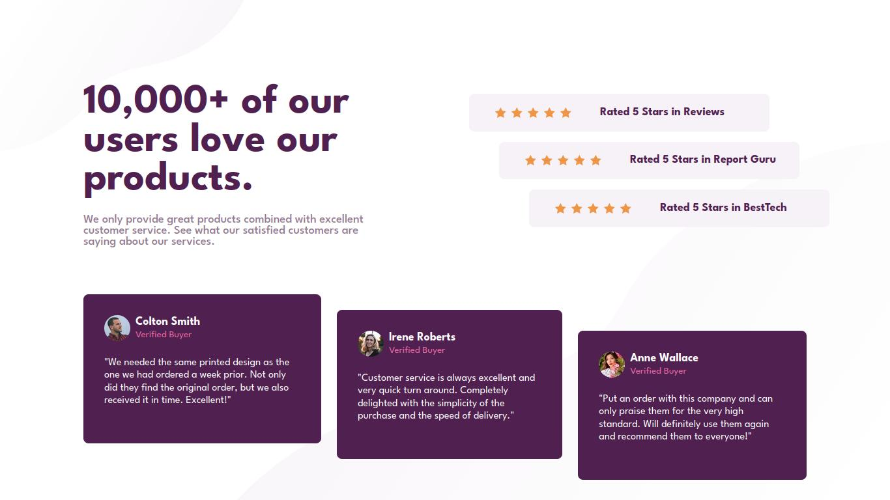

# Frontend Mentor - Social proof section solution

This is a solution to the [Social proof section challenge on Frontend Mentor](https://www.frontendmentor.io/challenges/social-proof-section-6e0qTv_bA). Frontend Mentor challenges help you improve your coding skills by building realistic projects. 

## Table of contents

- [Overview](#overview)
  - [The challenge](#the-challenge)
  - [Screenshot](#screenshot)
  - [Links](#links)
- [My process](#my-process)
  - [Built with](#built-with)
  - [What I learned](#what-i-learned)
- [Author](#author)

## Overview

### The challenge

Users should be able to:

- View the optimal layout for the section depending on their device's screen size

### Screenshot

### Links

- Solution URL: [Github Repo](https://github.com/PedroReves/Social-Proof-Website)
- Live Site URL: [Live Website](https://pedroreves.github.io/Social-Proof-Website/)

## My process

### Built with

- Semantic HTML5 markup
- CSS custom properties
- Flexbox

### What I learned

In this project i learned more about positioning items in the website, i learned more about responsiveness and how to adjust your website to different screens, and it was a good project, i think my css was a little messy, but nothing thati can't work with

## Author

- Frontend Mentor - [@PedroReves](https://www.frontendmentor.io/profile/PedroReves)

